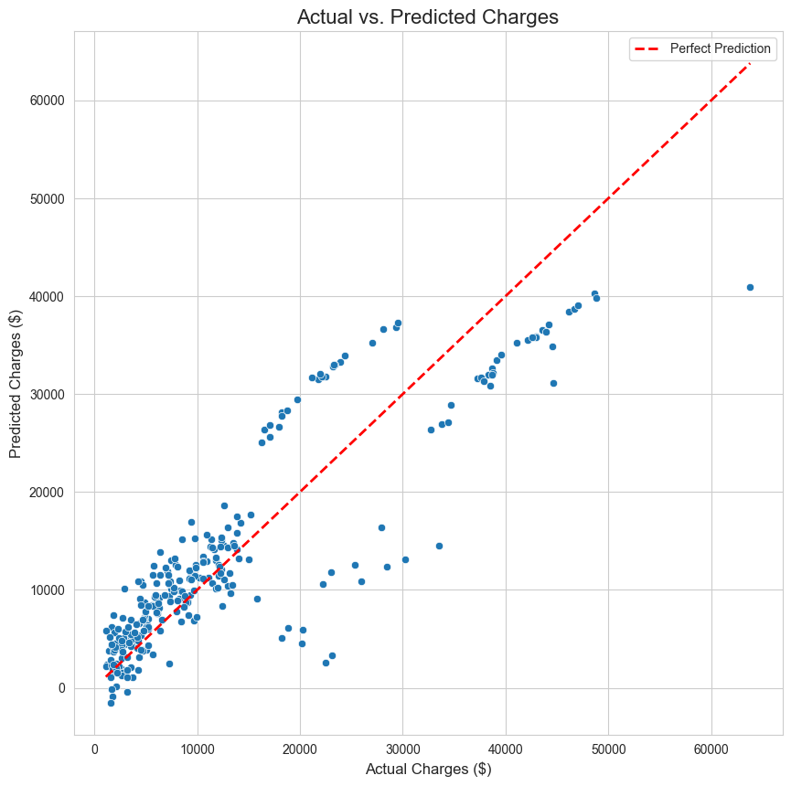

# Medical Insurance Cost Prediction (Machine Learning)

### A project to predict medical insurance costs using a Linear Regression model.


## Project Overview

This project focuses on building a machine learning model to predict medical insurance costs for individuals based on their personal attributes. It serves as a practical application of regression modeling and follows a standard data science workflow, from data preprocessing to model evaluation.

This project is the machine learning counterpart to a separate Exploratory Data Analysis (EDA) project, demonstrating a complete end-to-end data science process.

## Key Objectives

*   To preprocess raw data into a format suitable for a machine learning model.
*   To build and train a Linear Regression model to predict insurance charges.
*   To evaluate the model's performance using standard regression metrics (R² and MAE).
*   To interpret the model's results and understand its predictive power.

## Dataset

The dataset used is the "Medical Cost Personal Datasets" from Kaggle, which includes information such as age, sex, BMI, number of children, smoking status, region, and the individual's medical charges.

**Data Preprocessing Steps:**
*   **One-Hot Encoding:** Converted categorical features (`sex`, `smoker`, `region`) into a numerical format that the model can understand.
*   **Data Splitting:** Divided the dataset into an 80% training set and a 20% testing set to ensure an unbiased evaluation of the model.

## Model Performance

The trained Linear Regression model achieved the following results on the unseen test data:
*   **R-squared (R²):** **0.78** (The model explains approximately 78% of the variance in insurance costs).
*   **Mean Absolute Error (MAE):** **~$4,181** (On average, the model's predictions are off by about $4,181).

## Technical Stack

*   **Language:** Python 3.13
*   **Libraries:**
    *   Pandas & NumPy for data manipulation.
    *   Matplotlib & Seaborn for data visualization.
    *   Scikit-learn for building and evaluating the machine learning model.
*   **Environment Management:** `uv`

## How to Run This Project

1.  **Clone the repository:**
    ```bash
    git clone https://github.com/YOUR_USERNAME/insurance-cost-prediction-ml.git
    cd insurance-cost-prediction-ml
    ```

2.  **Create and activate a virtual environment and install dependencies:**
    ```bash
    uv venv
    source .venv/bin/activate
    uv pip install -r requirements.txt
    ```

3.  **Launch JupyterLab and run the notebook.**

## Visualizations Showcase


*A scatter plot comparing the model's predictions to the actual insurance charges. The closer the points are to the red "Perfect Prediction" line, the more accurate the model is.*